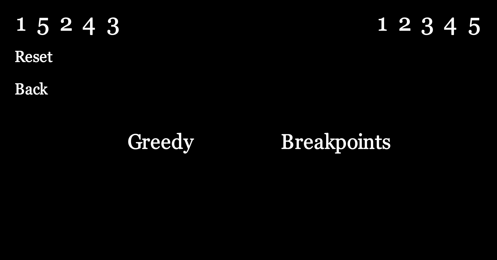

# Linear Representation

After you clicked on `Linear` , you will see this:

<figure><figcaption></figcaption></figure>

In the next 2 pages, we will show each algorithm separately.

Next is Breakpoint Algorithm.
