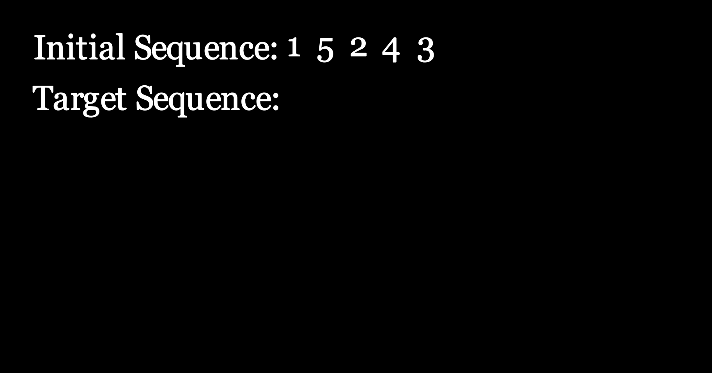

# Onboarding

The visualization window will look like this:

<figure><figcaption>
Visualization window startup
</figcaption></figure>

Now, user is required to enter the initial sequence. Accepted formats are either all alphabetical letters or all numbers. After entering the initial sequence, Hit `Enter` .

Now, Enter the target sequence and Hit `Enter`:

<figure><figcaption></figcaption></figure>

Then:

<figure><figcaption></figcaption></figure>

As shown above, there are 2 options on the top left, `Reset` and `Back` .

`Reset`  will reset sequences and ask the user re-enter them.

`Back`  will return you to this stage.

In the following chapter, we will show how linear representation work.

You can skip to [circular-representation.md](circular-representation.md "mention").
